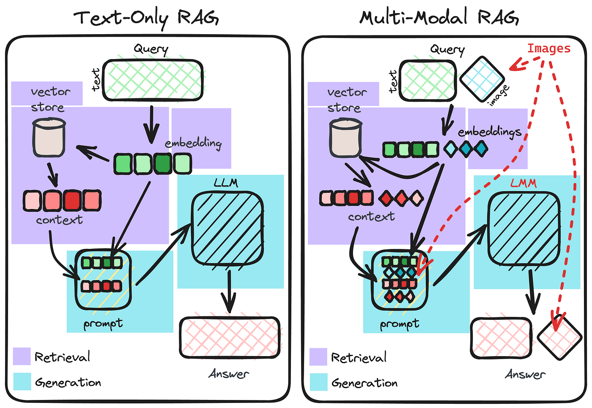

> Evaluating Multi-Modal Retrieval-Augmented Generation, LLaMaIndex

# A practical example for Large Multimodal Model

Sorry for the late update, I'm kind of busy these days 😅

You can check this [slidedeck](./slide/SlideTechtalk.pptx) in my techtalk for more insights 👇

## How to code organize?

```
.
├── 1-multimodal-llm
├── 2-mm-embedding-rag
├── 3-mm-captioning-rag
├── 4-observation
├── README.md
├── documents
└── requirements.txt
```

There will be 4 parts of this example:

1. Multimodal LLM: A chatbot that can understand images
   - 2-3: A chatbot empowered multimodal RAG helps query over a software project document such as design, API, DB schema, etc.
     - 2-mm-embedding-rag: using multimodal embedding CLIP to index image data  
     - 3-mm-captioning-rag: transform images into descriptive text and index as text
2. Observation: A simple integration with _phoenix_ to monitor RAG usage

## How to run these examples?

- First, set up your Python environment
- Get an OpenAI API Key and put it into a `.env` file with format:
```
OPENAI_API_KEY=<your api key>
```
- Install necessary dependencies using:

```py
pip install -r requirements.txt
```

- Our project uses Chainlit, so for every example, run:

```
cd <example> & chainlit run app.py -w
```

It will open a website for you.

## How to get the most out of it?

- Take a look at my recent Techtalk slidedeck

- Try to apply it with your data 📊

- Keep learning! 😄