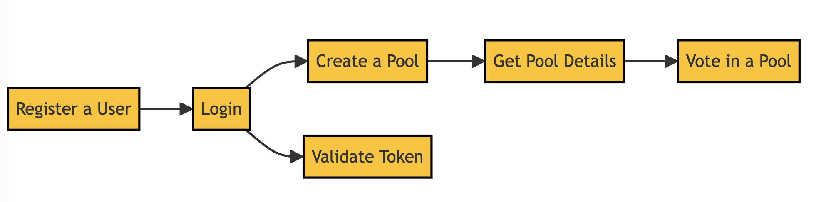
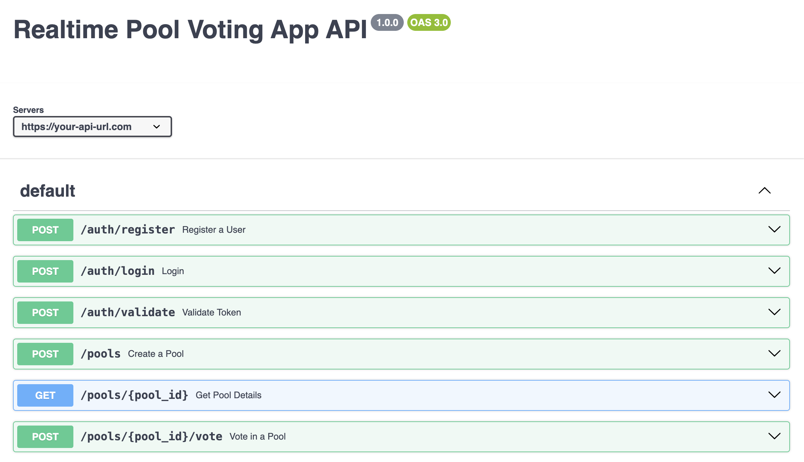

## API Documentation

### Introduction


This API documentation provides details about the endpoints, request/response formats, authentication/authorization mechanisms, and guidelines for the Realtime Pool Voting App.

### Base URL
The base URL for all API endpoints is `https://your-api-url.com`.

### Authentication
The Realtime Pool Voting App uses Firebase for authentication. To access protected endpoints, you need to include an `Authorization` header in your requests with a valid Firebase ID token.

### Endpoints



#### 1. Create a Pool
- URL: `/pools`
- Method: `POST`
- Description: Creates a new pool for voting.
- Request Body:
  ```json
  {
    "name": "Pool Name",
    "options": ["Option 1", "Option 2", "Option 3"]
  }
  ```
- Response:
  - Status: `201 Created`
  - Body:
    ```json
    {
      "id": "pool_id",
      "name": "Pool Name",
      "options": ["Option 1", "Option 2", "Option 3"],
      "votes": {
        "Option 1": 0,
        "Option 2": 0,
        "Option 3": 0
      }
    }
    ```

#### 2. Get Pool Details
- URL: `/pools/{pool_id}`
- Method: `GET`
- Description: Retrieves the details of a specific pool.
- Response:
  - Status: `200 OK`
  - Body:
    ```json
    {
      "id": "pool_id",
      "name": "Pool Name",
      "options": ["Option 1", "Option 2", "Option 3"],
      "votes": {
        "Option 1": 10,
        "Option 2": 5,
        "Option 3": 3
      }
    }
    ```

#### 3. Vote in a Pool
- URL: `/pools/{pool_id}/vote`
- Method: `POST`
- Description: Casts a vote for an option in a pool.
- Request Body:
  ```json
  {
    "option": "Option 1"
  }
  ```
- Response:
  - Status: `200 OK`
  - Body:
    ```json
    {
      "id": "pool_id",
      "name": "Pool Name",
      "options": ["Option 1", "Option 2", "Option 3"],
      "votes": {
        "Option 1": 11,
        "Option 2": 5,
        "Option 3": 3
      }
    }
    ```


#### 4. Register a User
- URL: `/auth/register`
- Method: `POST`
- Description: Registers a new user.
- Request Body:
  ```json
  {
    "email": "user@example.com",
    "password": "password123"
  }
  ```
- Response:
  - Status: `201 Created`
  - Body:
    ```json
    {
      "id": "user_id",
      "email": "user@example.com"
    }
    ```

#### 5. Login
- URL: `/auth/login`
- Method: `POST`
- Description: Authenticates a user and returns an access token.
- Request Body:
  ```json
  {
    "email": "user@example.com",
    "password": "password123"
  }
  ```
- Response:
  - Status: `200 OK`
  - Body:
    ```json
    {
      "access_token": "your_access_token"
    }
    ```

#### 6. Validate Token
- URL: `/auth/validate`
- Method: `POST`
- Description: Validates an access token.
- Request Body:
  ```json
  {
    "access_token": "your_access_token"
  }
  ```
- Response:
  - Status: `200 OK`
  - Body:
    ```json
    {
      "valid": true
    }
    ```


### Error Handling
In case of errors, the API will respond with appropriate status codes and error messages in the response body. Here are some common error scenarios:

- `400 Bad Request`: Invalid request format or missing required fields.
- `401 Unauthorized`: Missing or invalid Firebase ID token.
- `404 Not Found`: Pool not found with the specified ID.

### Conclusion
This API documentation provides an overview of the available endpoints and their functionalities for the Realtime Pool Voting App. Please ensure you follow the guidelines and include the necessary authentication headers when making requests to the API.