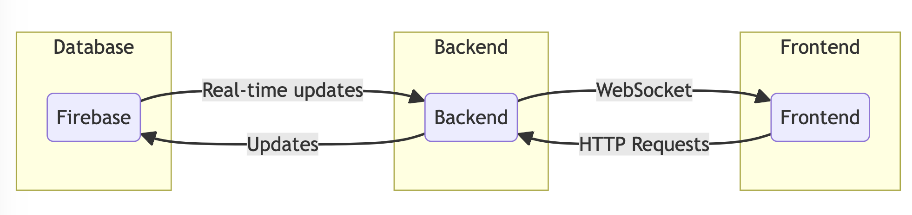

# Architecture Design Document

## 1. Introduction
This document provides an overview of the architecture for the Realtime Pool Voting application. It describes the frontend, backend, and database components, as well as the technologies used, communication protocols, data flow, and integration points with external systems.

## 2. Application Overview
The Realtime Pool Voting application is designed to facilitate real-time voting for pool-related activities. The frontend is built using ReactJS, the backend is implemented using Python FastAPI, and the database is Firebase.

## 3. Architecture Components

### 3.1 Frontend
The frontend of the application is developed using ReactJS, a popular JavaScript library for building user interfaces. ReactJS provides a responsive and interactive user interface that allows users to view and participate in pool voting activities. It communicates with the backend through RESTful APIs.

### 3.2 Backend
The backend of the application is implemented using Python FastAPI, a modern, fast (high-performance), web framework for building APIs. FastAPI provides a robust and scalable backend infrastructure to handle incoming requests from the frontend. It interacts with the Firebase database to store and retrieve voting data.

### 3.3 Database
The database for the application is Firebase, a cloud-based NoSQL database. Firebase provides real-time data synchronization and offline support, making it suitable for the real-time nature of the pool voting application. It stores the voting data, including user votes, pool options, and other relevant information.

## 4. Communication Protocols
The communication between the frontend, backend, and database components of the application is facilitated through the following protocols:

- HTTP: The frontend communicates with the backend using RESTful APIs over HTTP. It sends requests to the backend to retrieve pool options, submit votes, and receive updates on voting results.

- WebSocket: To enable real-time updates and notifications, the frontend establishes a WebSocket connection with the backend. This allows the backend to push updates to the frontend whenever there are changes in the voting results.

## 5. Data Flow
The data flow in the Realtime Pool Voting application is as follows:

1. The frontend sends HTTP requests to the backend to retrieve pool options and submit votes.
2. The backend receives the requests, validates and processes them, and updates the Firebase database accordingly.
3. The Firebase database stores the voting data and triggers real-time updates.
4. The backend, upon receiving updates from the database, pushes the updated voting results to the frontend using WebSocket.
5. The frontend receives the updates and reflects the changes in the user interface in real-time.

## 6. Integration Points with External Systems
The Realtime Pool Voting application integrates with the following external systems:

- Firebase: The application uses Firebase as the database to store and retrieve voting data. It leverages Firebase's real-time synchronization and offline support capabilities to provide a seamless voting experience.

## 7. Conclusion
This Architecture Design Document provides an overview of the Realtime Pool Voting application's architecture, including the frontend, backend, and database components. It outlines the technologies used, communication protocols, data flow, and integration points with external systems. This document serves as a reference for understanding the overall structure and design of the application.