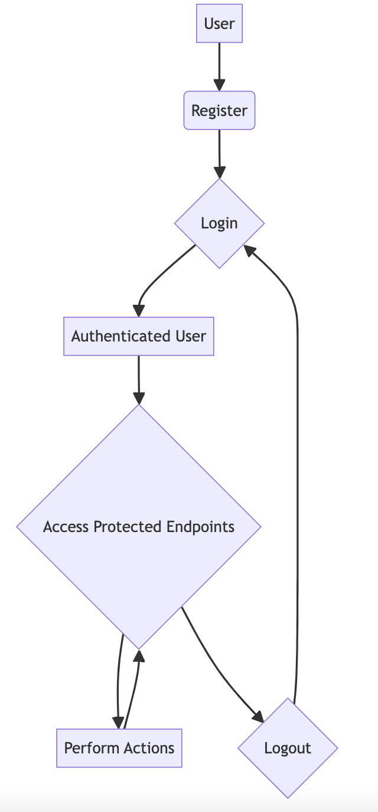

# Authentication Documentation

The Realtime Pool Voting App uses Firebase for authentication. Firebase provides a secure and reliable authentication system that integrates well with various platforms and frameworks. Here are the details of the authentication process:

## User Registration
1. Users can register for an account using their email and password or through social login providers like Google
2. When registering with an email and password, the user's credentials are securely stored in Firebase.
3. For social login providers, Firebase handles the authentication process and securely stores the user's information.

## User Login
1. Users can log in to the Realtime Pool Voting App using their registered email and password or through social login providers.
2. Firebase verifies the user's credentials and generates a Firebase ID token upon successful authentication.
3. The Firebase ID token is used for subsequent requests to protected endpoints.

## Protected Endpoints
1. To access protected endpoints, users must include an `Authorization` header in their requests.
2. The `Authorization` header should contain the Firebase ID token obtained during the login process.
3. The server validates the Firebase ID token to ensure the user is authenticated and authorized to access the requested resource.

## User Logout
1. Users can log out of the Realtime Pool Voting App, which invalidates their Firebase ID token.
2. Once logged out, the user will need to reauthenticate to access protected endpoints.

# Workflow Diagram

Below is a workflow diagram illustrating the high-level process flow of the Realtime Pool Voting App:

This workflow diagram showcases the typical user journey, starting from registration and login, followed by accessing protected endpoints, performing actions, and finally logging out.

By following this authentication process and workflow, you can ensure secure access to the Realtime Pool Voting App and protect user data.