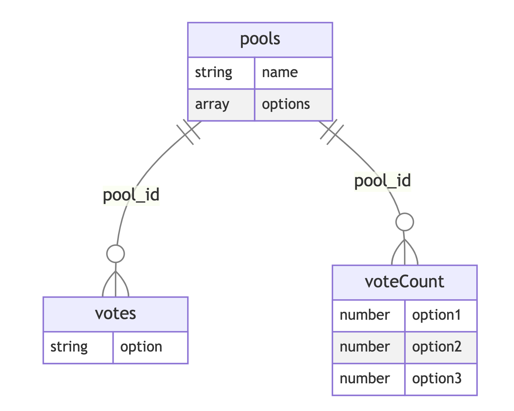

# Database Schema

The Firebase database for the Realtime Pool Voting App consists of the following collections, documents, and fields to store the voting data:



## Collection: pools
This collection stores information about the pools created for voting.

### Document: {pool_id}
Each document represents a specific pool and is identified by a unique `pool_id`.

#### Fields:
- `name` (string): The name of the pool.
- `options` (array of strings): The available voting options for the pool.

Example:
```json
{
  "name": "Pool Name",
  "options": ["Option 1", "Option 2", "Option 3"]
}
```

## Collection: votes
This collection stores the votes casted by users for each pool.

### Document: {pool_id}
Each document represents a specific pool and is identified by the same `pool_id` used in the `pools` collection.

#### Fields:
- `option` (string): The voting option chosen by the user.

Example:
```json
{
  "option": "Option 1"
}
```

## Collection: voteCount
This collection stores the vote count for each option in a pool.

### Document: {pool_id}
Each document represents a specific pool and is identified by the same `pool_id` used in the `pools` collection.

#### Fields:
- `option1` (number): The vote count for Option 1.
- `option2` (number): The vote count for Option 2.
- `option3` (number): The vote count for Option 3.

Example:
```json
{
  "option1": 10,
  "option2": 5,
  "option3": 3
}
```

By following this database schema, you can ensure consistency and easily retrieve and update the voting data for each pool in the Realtime Pool Voting App.