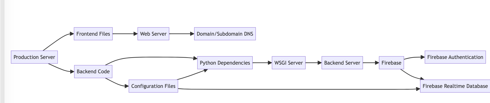

# Deployment Guide

This deployment guide provides instructions on how to deploy your Realtime Pool Voting App to a production environment. The guide covers setting up the frontend, backend, and database components, as well as any necessary configurations or dependencies.

## Prerequisites
Before proceeding with the deployment, ensure you have the following:

- A production server or hosting environment.
- A domain or subdomain for your application (e.g., `your-app-domain.com`).
- Access to the Firebase console to set up the database.

## Frontend Deployment

1. Build the ReactJS frontend:
   - Run `npm install` to install the project dependencies.
   - Run `npm run build` to create a production-ready build of the frontend.

2. Serve the frontend files:
   - Copy the contents of the `build` folder generated in the previous step to your production server or hosting environment.
   - Configure your web server (e.g., Nginx, Apache) to serve the frontend files.
   - Set up the necessary domain or subdomain DNS records to point to your server.

## Backend Deployment

1. Set up the Python FastAPI backend:
   - Copy your backend code to your production server or hosting environment.

2. Install the required Python dependencies:
   - Create a virtual environment: `python3 -m venv venv`.
   - Activate the virtual environment: `source venv/bin/activate`.
   - Install the dependencies: `pip install -r requirements.txt`.

3. Configure the backend:
   - Update the necessary configuration files (e.g., `config.py`) with your Firebase credentials and other environment-specific settings.

4. Run the backend server:
   - Start the backend server using a production-ready WSGI server (e.g., Gunicorn): `gunicorn -w 4 -k uvicorn.workers.UvicornWorker main:app`.
   - Ensure the backend server is accessible on the desired port (e.g., port 8000).

## Database Setup

1. Set up Firebase:
   - Create a Firebase project in the Firebase console.
   - Enable the Firebase Authentication service and configure it to work with your frontend.
   - Set up the Firebase Realtime Database and configure the necessary security rules.

2. Configure the backend to connect to Firebase:
   - Update the backend configuration files with your Firebase project credentials (e.g., API key, project ID).

## Final Steps

1. Test the deployment:
   - Access your application using the configured domain or subdomain.
   - Verify that the frontend is accessible and can communicate with the backend.

2. Monitor and maintain your application:
   - Set up logging and monitoring tools to track the performance and health of your application.
   - Regularly update and patch your application components to ensure security and stability.

Congratulations! Your Realtime Pool Voting App is now deployed to a production environment. Ensure you follow best practices for security, scalability, and performance optimization to provide a reliable and efficient voting experience for your users.