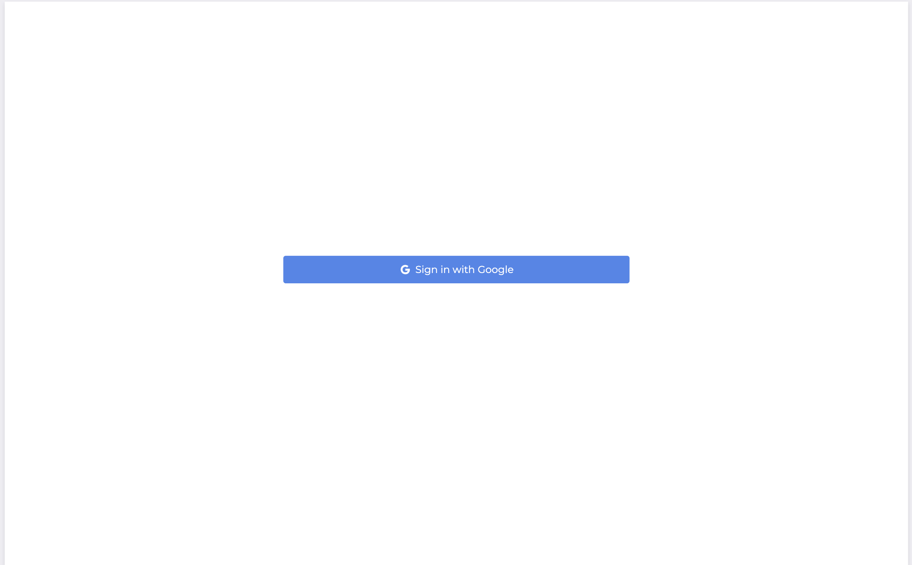
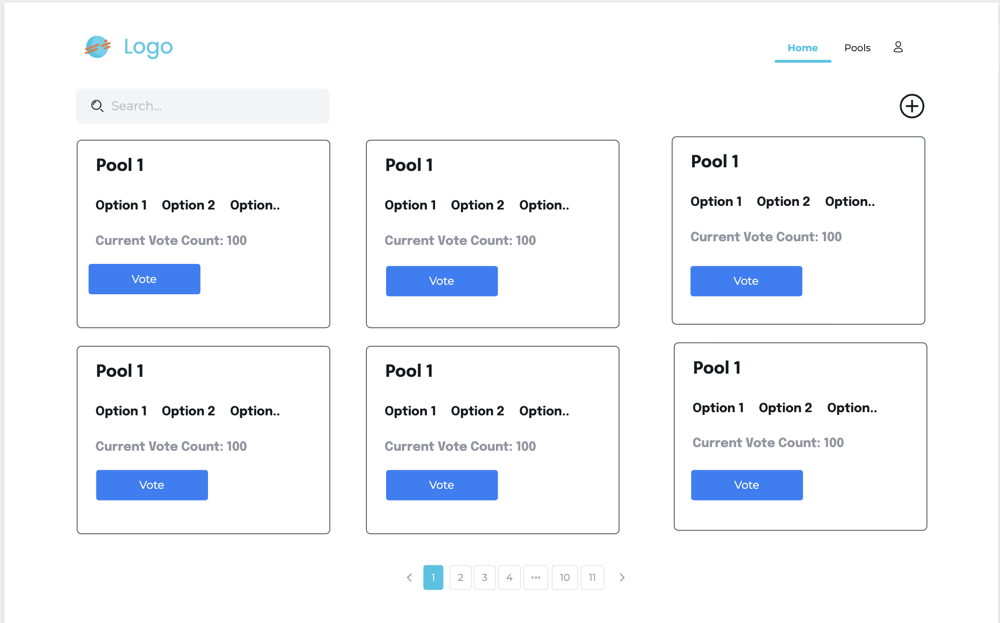
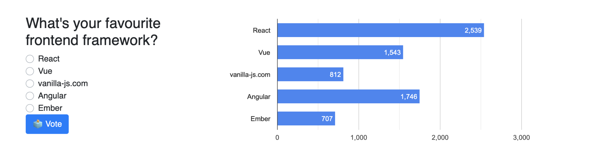
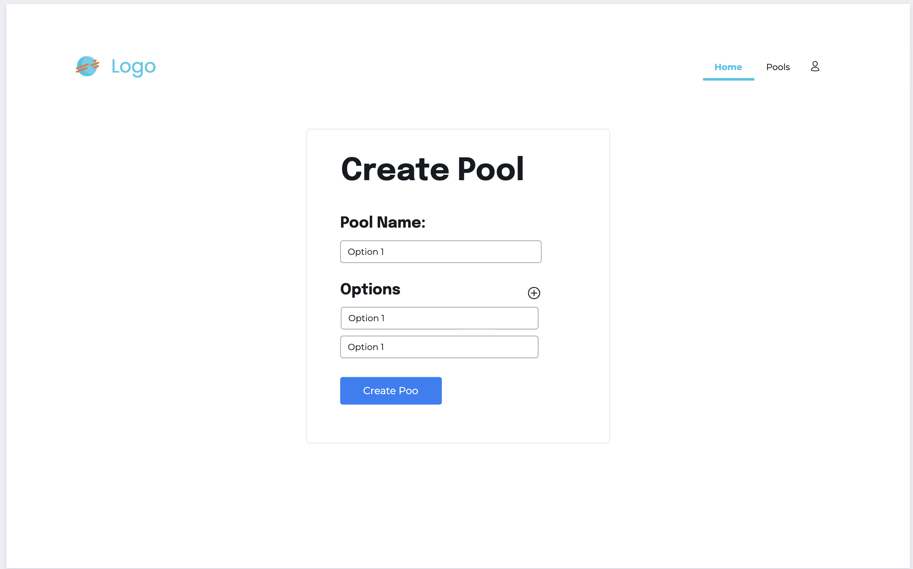

## User Interface (UI) Design Guidelines

### Layout and Navigation
- Use a responsive layout to ensure the application is accessible on different devices.
- Implement a navigation bar or sidebar to provide easy access to different sections of the application.
- Include a header section to display the application name or logo.

### Login Screen

### Home Page

- Display a list of available pools for voting.
- Show the pool name, options, and the current vote count for each pool.
- Provide a button or link to navigate to the details page of a specific pool.

### Pool Details Page

- Show the pool name and options at the top of the page.
- Display the current vote count for each option.
- Include a form or buttons to allow users to cast their votes.
- Update the vote count in real-time when a vote is casted.

### Create Pool Page

- Provide a form to allow users to create a new pool.
- Include input fields for the pool name and options.
- Validate the form inputs to ensure they meet the required criteria.
- Display error messages if the form inputs are invalid.

### Error Handling
- Implement error handling for scenarios such as invalid requests, authentication failures, or database errors.
- Display appropriate error messages to the users when errors occur.

### Styling and Branding
- Use consistent styling throughout the application to maintain a cohesive look and feel.
- Apply appropriate colors, fonts, and spacing to enhance the user experience.
- Consider using a CSS framework like Bootstrap or Material-UI for easier styling and responsiveness.

These guidelines should help you create a visually appealing and user-friendly frontend for your Realtime Pool Voting App using ReactJS. Remember to adapt these guidelines to your specific design requirements and preferences.